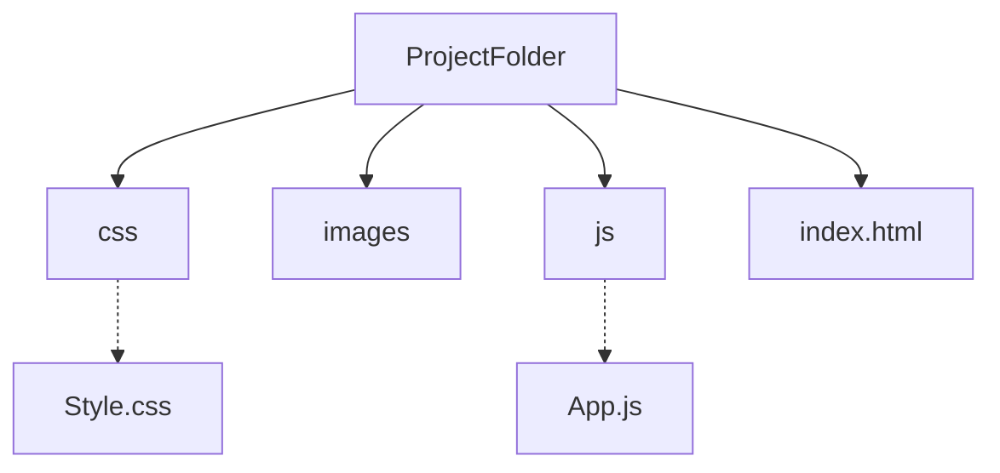

# Boiler Plate JavaScript file for web development
By executing this javascipt file using node will made folders and files automatically.

<strong>Note:</strong> Please use Prettier Code formatter to format Code in HTML file.

## Steps to use this JavaScript file.

<ul>
  <li> Copy the "boilerPlate.js" file in the folder where you want to create the Project folder.</li>
  <li> Open Command Propmt or other Terminal.</li>
  <li> Use <code> node boilerPlate.js &lt; Name of your Project &gt;</code> </li> for executing the file.
</ul>

## File stucture created by JS file.

